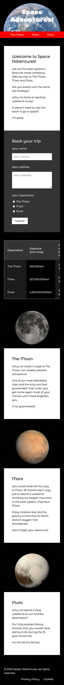
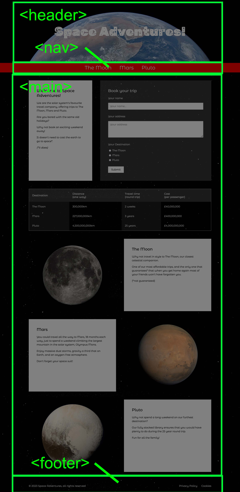
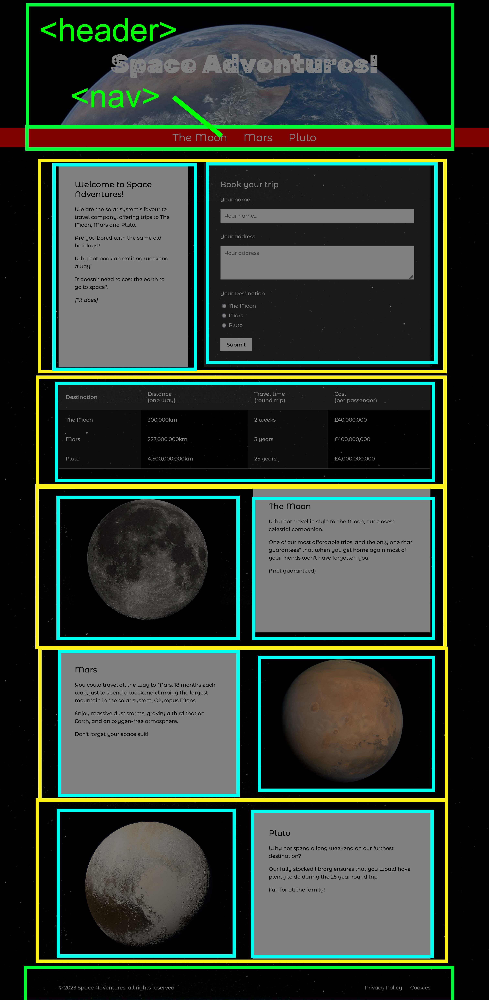

# Space Adventures
---

This document will take you through the process of building a web page based on a supplied design.

By the end of this you should be able to take a design and create the HTML and CSS needed to reproduce it in a web browser


---

## The Website

### Project brief

We are going to build the home page of a new website for _Space Adventures!_ - a company who offer tours of the solar system.

The site has already been designed. There is one design for the mobile home page, and a wider version for larger screens such as laptops, desktops and tables. You can see them below.

<style>
  .screenshots {
    display: flex;
  }
  .screenshots a {
    margin-right: 10px;
  }
</style>

<div class="screenshots">
  <a href="./images/desktop.png">
      
  </a>
  <a href="./images/mobile.png">
      
  </a>
</div>

If you would like to look at the 'finished' website, you can find it here:

 - [HTML](./examples/final.html)
 - [CSS](./examples/final.css)


### 2.2 - Process

We're going to run through the following process in order to put this page together:

1. HTML structure: First, we'll identify and put together the structure, adding the structural markup for the header, footer and main content
2. HTML content: Next, we'll put all of the text content into the HTML file, and also the tables, forms and images.
3. CSS structure: We'll start on the CSS by putting in place a structure and some 'global' styles
4. Mobile CSS: We'll then add styles section-by-section. These styles will be targeted at mobile browsers
5. Desktop CSS: Once the mobile layout is done, we'll start adding extra styles to add columns and layout for wider browsers

Note that you don't always follow this exact process, and you don't always complete one stage before moving on to the next, but it often helps to follow a logical, step-by-step process.


---

## HTML structure

### Initial structure

First, we need to create a new HTML page. We can call this `space.html`.

Its initial structure will follow a familiar format:

```html
<!doctype html>
<html>
    <head>
        <meta charset="utf-8" />
        <meta name="viewport" content="width=device-width, initial-scale=1">
        <title>Space Adventures!</title>
        <link rel="stylesheet" href="space.css" />
    </head>
    <body>
        <!-- our content will go here -->
    </body>
</html>
```

You should open this page in a browser window. There isn't much to see yet but it will be handy to have it ready so we can keep refreshing to see our progress.


### Structural elements

We have learned about HTML structural elements, some of which will be useful here:

- `<header>`
- `<nav>`
- `<main>`
- `<footer>`

Next, we can take our design and divide it up to identify what content fits into these structural elements:




Adding these into our HTML page, we should end up with something like this:

```html
<!doctype html>
<html>
    <head>
        <meta charset="utf-8" />
        <meta name="viewport" content="width=device-width, initial-scale=1">
        <title>Space Adventures!</title>
        <link rel="stylesheet" href="space.css" />
    </head>
    <body>
        <header></header>
        <nav></nav>
        <main></main>
        <footer></footer>
    </body>
</html>
```


### Main content structure

We could divide up the main content further, which will make it a little easier to differentiate between the different blocks.

The design contains several rows of content, some of which have columns within them.

Some of these columns will share styles such as text colour, background colour and border. We'll add these styles later.

By identifying the different types of columns now, we can decide on what class names we'll use, which will make them easier to style.

In the image below, the yellow boxes show the rows, and the blue boxes show the columns within each row.



We can add the rows and columns to our HTML by using `<div>` elements with class names. It doesn't matter what these class names are, as long as they are descriptive and memorable:

```html
<div class="row">
    <div class="column">
    </div>
    <div class="column">
    </div>
</div>
```

When we add these into our HTML it should look like this:

```html
<!doctype html>
<html>
    <head>
        <meta charset="utf-8" />
        <meta name="viewport" content="width=device-width, initial-scale=1">
        <title>Space Adventures!</title>
        <link rel="stylesheet" href="space.css" />
    </head>
    <body>
        <header>
        </header>
        <nav>
        </nav>
        <main>
            <div class="row">
                <div class="column">
                </div>
                <div class="column">
                </div>
            </div>
            <div class="row">
                <div class="column">
                </div>
            </div>
            <div class="row" id="moon">
                <div class="column">
                </div>
                <div class="column">
                </div>
            </div>
            <div class="row" id="mars">
                <div class="column">
                </div>
                <div class="column">
                </div>
            </div>
            <div class="row" id="pluto">
                <div class="column">
                </div>
                <div class="column">
                </div>
            </div>
        </main>
        <footer>
        </footer>
    </body>
</html>
```

You can see our work-in-progress HTML file here:

- [HTML](./examples/html-structure.html)

---

## HTML Content

Next, we'll add the content to our page.


### Text content

To make it easier to enter the content, here is the text contained in the designs, so that you can copy and paste it into your page:


#### Header

> Space Adventures!

This could be an `<h1>` element as it is the main title of the page:

```html
<h1>Space Adventures</h1>
```


#### Nav

> - The Moon
> - Mars
> - Pluto

These could be `<li>` list items in a `<ul>` unordered list:

```html
<ul>
    <li>
        <a href="#moon">The Moon</a>
    </li>
    <li>
        <a href="#mars">Mars</a>
    </li>
    <li>
        <a href="#pluto">Pluto</a>
    </li>
</ul>
```


#### Main content

##### Welcome column

> **Welcome to Space Adventures!**
>
> We are the solar system's favourite travel company, offering trips to The Moon, Mars and Pluto.
>
> Are you bored with the same old holidays?
>
> Why not book an exciting weekend away!
>
> It doesn't need to cost the earth to go to space*.
>
> (*it does)

This could be an `<h2>` heading followed by `<p>` paragraphs of text:

```html
<h2>Welcome to Space Adventures!</h2>
<p>We are the solar system's favourite travel company, offering trips to The Moon, Mars and Pluto.</p>
<p>Are you bored with the same old holidays?</p>
<p>Why not book an exciting weekend away!</p>
<p>It doesn't need to cost the earth to go to space*.</p>
<p><em>(*it does)</em></p>
```


##### Book your trip column

> Book your trip
>
> Your name
>
> Your address
>
> Your Destination
> - The Moon
> - Mars
> - Pluto
>
> Submit

This should be a `<form>` element and the various form input elements:

```html
<form method="POST" action="">
    <div class="input">
        <p class="input-title">Your name</p>
        <input type="text" name="name" placeholder="Your name..." />
    </div>
    <div class="input">
        <p class="input-title">Your address</p>
        <textarea name="address" placeholder="Your address" rows="4" cols="50"></textarea>
    </div>
    <div class="input">
        <p class="input-title">Your Destination</p>
        <label>
            <input type="radio" name="destination" value="The Moon" />
            The Moon
        </label>
        <label>
            <input type="radio" name="destination" value="Mars" />
            Mars
        </label>
        <label>
            <input type="radio" name="destination" value="Pluto" />
            Pluto
        </label>
    </div>
    <button>Submit</button>
</form>
```


##### Destinations column

<table>
 <thead>
  <tr>
   <th>Destination</th>
   <th>Distance <br />(one way)</th>
   <th>Travel time <br />(round trip)</th>
   <th>Cost <br />(per passenger)</th>
  </tr>
 </thead>
 <tbody>
  <tr>
   <td>The Moon</td>
   <td>300,000km</td>
   <td>2 weeks</td>
   <td>£40,000,000</td>
  </tr>
  <tr>
   <td>Mars</td>
   <td>227,000,000km</td>
   <td>3 years</td>
   <td>£400,000,000</td>
  </tr>
  <tr>
   <td>Pluto</td>
   <td>4,500,000,000km</td>
   <td>25 years</td>
   <td>£4,000,000,000</td>
  </tr>
 </tbody>
</table>

This should be a `table` element.

```html
<table>
    <thead>
        <tr>
            <th>Destination</th>
            <th>Distance <br />(one way)</th>
            <th>Travel time <br />(round trip)</th>
            <th>Cost <br />(per passenger)</th>
        </tr>
    </thead>
    <tbody>
        <tr>
            <td>The Moon</td>
            <td>300,000km</td>
            <td>2 weeks</td>
            <td>£40,000,000</td>
        </tr>
        <tr>
            <td>Mars</td>
            <td>227,000,000km</td>
            <td>3 years</td>
            <td>£400,000,000</td>
        </tr>
        <tr>
            <td>Pluto</td>
            <td>4,500,000,000km</td>
            <td>25 years</td>
            <td>£4,000,000,000</td>
        </tr>
    </tbody>
</table>
```

##### The Moon column

> **The Moon**
>
> Why not travel in style to The Moon, our closest celestial companion.
>
> One of our most affordable trips, and the only one that guarantees* that when you get home again most of your friends won't have forgotten you.
>
> (*not guaranteed)

This could be an `<h2>` heading followed by `<p>` paragraphs of text.


##### Mars column

> **Mars**
>
> You could travel all the way to Mars, 18 months each way, just to spend a weekend climbing the largest mountain in the solar system, Olympus Mons.
>
> Enjoy massive dust storms, gravity a third that on Earth, and an oxygen-free atmosphere.
>
> Don't forget your space suit!

This could be an `<h2>` heading followed by `<p>` paragraphs of text.


##### Pluto column

> **Pluto**
>
> Why not spend a long weekend on our furthest destination?
>
> Our fully stocked library ensures that you would have plenty to do during the 25 year round trip.
>
> Fun for all the family!

This could be an `<h2>` heading followed by `<p>` paragraphs of text.


#### Footer

> © 2024 Space Adventures, all rights reserved
>
> - Privacy Policy
> - Cookies

This could be a `<p>` paragraph followed by a `<ul>` unordered list:

```html
<p>&copy; 2024 Space Adventures, all rights reserved</p>
<ul>
    <li>
        <a href="#">Privacy Policy</a>
    </li>
    <li>
        <a href="#">Cookies</a>
    </li>
</ul>
```


### Image content

Here are the images used in the design:

 - [Earth](./examples/images/earth.jpg)
 - [The Moon](./examples/images/moon.jpg)
 - [Mars](./examples/images/mars.jpg)
 - [Pluto](./examples/images/pluto.jpg)
 - [Stars](./examples/images/stars.jpg)

 You should download these files and put them in a folder called `images`.

Note that the photos are downloaded from Wikipedia, and state that they are in the public domain - therefore they are free for us to use.


### 4.3 - Complete HTML

Once you have added all of the above, your HTML might look something like this:

```html
<!doctype html>
<html>
    <head>
        <meta charset="utf-8" />
        <meta name="viewport" content="width=device-width, initial-scale=1">
        <title>Space Adventures!</title>
        <link rel="stylesheet" href="space.css" />
    </head>
    <body>
        <header>
            <h1>Space Adventures!</h1>
        </header>

        <nav>
            <ul>
                <li>
                    <a href="#moon">The Moon</a>
                </li>
                <li>
                    <a href="#mars">Mars</a>
                </li>
                <li>
                    <a href="#pluto">Pluto</a>
                </li>
            </ul>
        </nav>

        <main>
            <div class="row">
                <div class="column">
                    <h2>Welcome to Space Adventures!</h2>
                    <p>We are the solar system's favourite travel company, offering trips to The Moon, Mars and Pluto.</p>
                    <p>Are you bored with the same old holidays?</p>
                    <p>Why not book an exciting weekend away!</p>
                    <p>It doesn't need to cost the earth to go to space*.</p>
                    <p><em>(*it does)</em></p>
                </div>
                <div class="column">
                    <h2>Book your trip</h2>
                    <form method="POST" action="">
                        <div class="input">
                            <p class="input-title">Your name</p>
                            <input type="text" name="name" placeholder="Your name..." />
                        </div>
                        <div class="input">
                            <p class="input-title">Your address</p>
                            <textarea name="address" placeholder="Your address" rows="4" cols="50"></textarea>
                        </div>
                        <div class="input">
                            <p class="input-title">Your Destination</p>
                            <label>
                                <input type="radio" name="destination" value="The Moon" />
                                The Moon
                            </label>
                            <label>
                                <input type="radio" name="destination" value="Mars" />
                                Mars
                            </label>
                            <label>
                                <input type="radio" name="destination" value="Pluto" />
                                Pluto
                            </label>
                        </div>
                        <button>Submit</button>
                    </form>
                </div>
            </div>

            <div class="row">
                <div class="column">
                    <table>
                        <thead>
                            <tr>
                                <th>Destination</th>
                                <th>Distance <br />(one way)</th>
                                <th>Travel time <br />(round trip)</th>
                                <th>Cost <br />(per passenger)</th>
                            </tr>
                        </thead>
                        <tbody>
                            <tr>
                                <td>The Moon</td>
                                <td>300,000km</td>
                                <td>2 weeks</td>
                                <td>£40,000,000</td>
                            </tr>
                            <tr>
                                <td>Mars</td>
                                <td>227,000,000km</td>
                                <td>3 years</td>
                                <td>£400,000,000</td>
                            </tr>
                            <tr>
                                <td>Pluto</td>
                                <td>4,500,000,000km</td>
                                <td>25 years</td>
                                <td>£4,000,000,000</td>
                            </tr>
                        </tbody>
                    </table>
                </div>
            </div>

            <div class="row" id="moon">
                <div class="column">
                    
                </div>
                <div class="column">
                    <h2>The Moon</h2>
                    <p>Why not travel in style to The Moon, our closest celestial companion.</p>
                    <p>One of our most affordable trips, and the only one that guarantees* that when you get home again most of your friends won't have forgotten you.</p>
                    <p>(*not guaranteed)</p>
                </div>
            </div>
            <div class="row" id="mars">
                <div class="column">
                    
                </div>
                <div class="column">
                    <h2>Mars</h2>
                    <p>You could travel all the way to Mars, 18 months each way, just to spend a weekend climbing the largest mountain in the solar system, Olympus Mons.</p>
                    <p>Enjoy massive dust storms, gravity a third that on Earth, and an oxygen-free atmosphere.</p>
                    <p>Don't forget your space suit!</p>
                </div>
            </div>
            <div class="row" id="pluto">
                <div class="column">
                    
                </div>
                <div class="column">
                    <h2>Pluto</h2>
                    <p>Why not spend a long weekend on our furthest destination?</p>
                    <p>Our fully stocked library ensures that you would have plenty to do during the 25 year round trip.</p>
                    <p>Fun for all the family!</p>
                </div>
            </div>
        </main>

        <footer>
            <p>&copy; 2024 Space Adventures, all rights reserved</p>
            <ul>
                <li>
                    <a href="#">Privacy Policy</a>
                </li>
                <li>
                    <a href="#">Cookies</a>
                </li>
            </ul>
        </footer>
    </body>
</html>
```

You can see our work-in-progress HTML file here:

- [HTML](./examples/html-content.html)


---

## CSS content

Now that the HTML is largely in place, we can start adding styles with CSS.

It may be that we still go back to tweak our HTML, for example adding extra class names so that we can apply extra styles, but the overall structure won't change much now.

We should start by creating a new CSS stylesheet, called `space.css`


### CSS Structure

We're going to be adding styles for each area of our HTML page, and so it can be handy to add some comments in to structure our CSS file. This should make it easier to find styles later.

Add this to `space.css` - eventually we'll add styles under each of these comments.

```css
/* global */

/* text */

/* media */

/* tables */

/* forms */

/* header */

/* nav */

/* main */

/* rows */

/* columns */

/* footer */
```

### Global styles

Something we learned previously is that it can be handy to apply `box-sizing` so that margins and padding work as expected, so we can add this to the `/* global */` section of our CSS file:

```css
/* global */
* {
    box-sizing: border-box;
}
```

### Background image

We have a black background, but if you look closely you'll see that it's actually a picture of stars. The link to download this image is above.

To add this background image to your page you can use the CSS below, added to the `/* global */` section - note that it assumes that the image is saved in a folder called `images`:

```css
body {
    background: url(./images/stars.jpg);
    background-size: contain;
    color: #fff;
    margin: 0;
}
```

When you try this in a browser, you might find that you would prefer the background image to remain stationary rather than scrolling as you move down the page. If you would like this effect, you can add the following style to the `body` declaration:

```css
background-attachment: fixed;
```


### Fonts

There are two custom fonts used in the page. These both come from [Google Fonts](https://fonts.google.com/), which we have learned about previously.

They are:

 - [Rubik Moonrocks](https://fonts.google.com/specimen/Rubik+Moonrocks) - for the main page title
 - [Montserrat Alternates](https://fonts.google.com/specimen/Montserrat+Alternates) - for the rest of the text

 To add these fonts, add this into the `<head>` of your HTML:

 ```html
<link rel="preconnect" href="https://fonts.googleapis.com">
<link rel="preconnect" href="https://fonts.gstatic.com" crossorigin>
<link href="https://fonts.googleapis.com/css2?family=Montserrat+Alternates&family=Rubik+Moonrocks&display=swap" rel="stylesheet">
 ```

To add the _Montserrat_ font, you can add this to the `body` element:

```css
body {
    font-family: 'Montserrat Alternates', sans-serif;
}
```

To add the _Rubik_ font for the `h1` in the `header`, you can add this:

```css
h1 {
    font-family: 'Rubik Moonrocks', cursive;
}
```

### Text

There are a few other styles that may make our design look a little nicer, these can be added under the `/* text */` section:

```css
h2 {
    margin-top: 0;
}

p {
    font-size: 16px;
    line-height: 24px;
}
```


### Images

Large images can break a layout. To limit the width of all images to their parent container, add the following style under the `/* media */` section:

```css
img {
    width: 100%;
}
```


### Tables

We can add some default styles to improve the layout of our tables:

```css
table {
    border: 2px solid rgba(255 255 255 / 0.4);
    border-collapse: collapse;
    width: 100%;
}
th {
    padding: 20px;
    background: rgba(255 255 255 / 0.2);
    text-align: left;
}
td {
    padding: 20px;
}
td:nth-child(odd) {
    background: rgba(255 255 255 / 0.1);
}
```


### Forms

We can also add some default styles to improve the layout of our forms:

```css
.input {
    margin-bottom: 30px;
}

input[type=text],
textarea {
    padding: 10px;
    width: 100%;
    font-size: 16px;
    font-family: 'Montserrat Alternates', sans-serif;
}

label {
    display: block;
    margin-bottom: 10px;
}

button {
    background: #fff;
    padding: 10px 20px;
    font-size: 16px;
    font-family: 'Montserrat Alternates', sans-serif;
    border: none;
    cursor: pointer;
}

button:hover {
    background: #ff0;
}
```


---

## Mobile CSS styles

At this point we don't have much CSS but we've put in place our structure so that we can start working through block by block and adding relevant styles.

We start with mobile-first styles, that is styles that should be applied for _all_ browsers.

Later we'll add styles with media queries that should only be applied for wider browsers like laptops, desktops and tablets.


### Header

The following styles should be added to the `/* header */` section of the CSS file.

#### Header background image

The header has a separate background image, it's a picture of the Earth, that expands to fill the available space.

The following styles assume we have already downloaded the picture and saved it in a folder called `images`:

```css
header {
    background: url(./images/earth.jpg);
    background-size: cover;
    background-position: center top;
}
```


#### Header text

We want to style the `<h1>` element within the `<header>` - we need to change its size, and use the custom font we selected earlier.

We have two choices when it comes to writing our CSS selector. We can either reference it by the CSS element, _or_ we can add a class and style that.

If we were to reference the CSS elements, we would say that we want to style the `<h1>` element within the `<header>` and so our selector would be:

```css
header h1 { ... }
```

Alternatively, we could add a class (e.g. `header-logo`) to our HTML:

```html
<header>
    <h1 class="header-logo">Space Adventures!</h1>
</header>
```

If we take this approach, the CSS is a simple class selector:


```css
.header-logo { ... }
```

Whichever option you choose, this is the CSS we want to apply to style the text:

```css
.header-logo {
    font-family: 'Rubik Moonrocks', cursive;
    font-size: 40px;
    text-align: center;
    padding: 50px 25px;
    margin: 0;
}
```


### Nav

The following styles should be added to the `/* nav */` section of the CSS file.

As with the example above, we could style selectors, or we could add some extra classes to our HTML so that the CSS selectors are simple, e.g.:

```html
<nav>
    <ul class="main-nav">
        <li class="main-nav-item">
            <a class="main-nav-link" href="#moon">The Moon</a>
        </li>
        ...
    </ul>
</nav>
```

#### Nav links

First, we need to apply some styles to the `<ul>` element so that it is centre-aligned, and the list items are placed next to one another in a single row:

```css
.main-nav {
    background: #f00;
    display: flex;
    justify-content: center;
    list-style: none;
    margin: 0;
    padding: 0;
}
```

We also want to add some individual styles for each link, to space them out and apply a separate hover style:

```css
.main-nav-link {
    display: block;
    color: #fff;
    font-size: 16px;
    text-decoration: none;
    padding: 10px 25px;
    transition: all 0.5s;
}

.main-nav-link:hover {
    color: #ff0;
}
```


#### Sticky nav

If we want to make the nav stay at the top of the screen when we scroll, we can make it `sticky`:

```css
nav {
    position: sticky;
    top: 0;
}
```


#### Smooth-scrolling

The links in the nav are internal links that jump down the page to the relevant section of the page. To make them scroll smoothly rather than jump, we can add the following style to the `/* global */` section of the stylesheet:

```css
html {
    scroll-behavior: smooth;
}
```


### Footer

We're going to do the footer before we look at the main content just because it's more simple so will be quicker to complete.

The following styles should be added to the `/* footer */` section of the CSS file.

As with the `<nav>`, we could style selectors, or we could add some extra classes to our HTML so that the CSS selectors are simple, e.g.:

```html
<footer>
    <p>&copy; 2024 Space Adventures, all rights reserved</p>
    <ul class="footer-nav">
        <li class="footer-nav-item">
            <a class="footer-nav-link" href="#">Privacy Policy</a>
        </li>
        <li class="footer-nav-item">
            <a class="footer-nav-link" href="#">Cookies</a>
        </li>
    </ul>
</footer>
```


#### Footer container

We want to ensure the footer has some padding so that the text doesn't align with the edges of the page:

```css
footer {
    padding: 10px 25px;
}
```

#### Footer nav

As with the `<nav>`, we want our footer links to sit next to one another:

```css
.footer-nav {
    display: flex;
    justify-content: center;
    list-style: none;
}

.footer-nav-link {
    display: block;
    color: #fff;
    text-decoration: none;
    padding-left: 25px;
    transition: all 0.5s;
}

.footer-nav-link:hover {
    color: #ff0;
}
```


### Main content

The following styles should be added to the `/* main */` section of the CSS file.

#### Rows

We want to add some vertical space between rows:

```css
.row {
    margin: 50px 0;
}
```

#### Columns

For each of the following column types, we want to add extra classes into our HTML so that the styles can be applied in the correct places.

You can add multiple extra classes after the initial `column` class, like so:

```html
<div class="column  column-with-text  column-background-white">...</div>
```

##### Columns containing text (and forms)

Columns that contain text or forms need extra padding:

```css
.column-with-text {
    padding: 50px;
}
```


##### Columns containing media

Columns that contain images only need horizontal padding:

```css
.column-with-media {
    padding: 0 50px;
}
```


##### Columns containing tables

Tables can be difficult to style for smaller screens.

There are a range of options, but one of the most simple is to allow tables to be scrolled horizontally.

We can achieve this by adding the following:

```css
.column-with-table {
    overflow: auto;
}
```


##### Columns with white backgrounds

Columns with white backgrounds also need black text:

```css
.column-background-white {
    background: #fff;
    color: #000;
}
```


##### Columns with semi-transparent backgrounds

Some columns have semi-transparent backgrounds:

```css
.column-background-transparent {
    background: rgba(255 255 255 / 0.2);
}
```

---

At this point we should have a website that looks like this:

 - [HTML](./examples/mobile.html)
 - [CSS](./examples/mobile.css)

---

## Responsive styles

We can pick a size at which our design no longer looks reasonable.

For this example we are going to use `900px`:

```css
@media (min-width: 900px) {
    /* responsive styles go here */
}
```

### Header

#### Header text

When the browser width is large enough, we can increase the size of our main page heading and the spacing around it.

This should be placed immediately after the previous `.header-logo` style definition, under the `/* header */` section.

```css
@media (min-width: 900px) {
    .header-logo {
        font-size: 80px;
        padding: 150px 25px;
    }
}
```


### Nav

#### Nav links

Again, when the browser width is large enough, the size of the nav font can be increased:

```css
@media (min-width: 900px) {
    .main-nav-link {
        font-size: 32px;
    }
}
```


### Footer

#### Footer nav

When the browser is wide enough, the footer can be put into columns, with the copyright text to one side and the navigation on the other.

We also centre the footer and restrict its overall width so that all content remains close to the centre of the screen.

```css
@media (min-width: 900px) {
    footer {
        max-width: 1200px;
        margin: 0 auto;
        display: flex;
        align-items: center;
        justify-content: space-between;
    }
}
```


### Main content

#### Main

As with the footer, when the main content area is wide enough we can centre it and restrict the width so that all main content stays close to the centre of the screen:

```css
@media (min-width: 900px) {
    main {
        max-width: 1200px;
        margin: 0 auto;
    }
}
```


#### Rows

When the browser width is large enough, we can introduce the columns into the main content area:

```css
@media (min-width: 900px) {
    .row {
        display: flex;
    }
}
```

#### Row-reversed

Looking again at the design, the last three rows alternate their content, so the image and text swap sides for the middle row.

The easiest way to do this is to reverse the direction of the flow for this row.

You can update your HTML with a new class name to reflect this:

```html
<div class="row row-reversed" id="mars">...</div>
```

Then we can add a new style for this `row-reversed` class:

```css
@media (min-width: 900px) {
    .row-reversed {
        flex-direction: row-reverse;
    }
}
```


#### Columns

When the browser width is wide enough, columns will need to be spaced equally using `flex`, and also we should add some horizontal space between them:

```css
@media (min-width: 900px) {
    .column {
        margin: 0 25px;
        flex: 1;
    }
}
```


#### Double-width columns

Finally, if we don't want equal width columns we can make some columns double the default width:

```css
.column-size-double {
    flex: 2;
}
```


---


If you would like to look at the 'finished' website, you can find it here:

 - [HTML](./examples/final.html)
 - [CSS](./examples/final.css)

